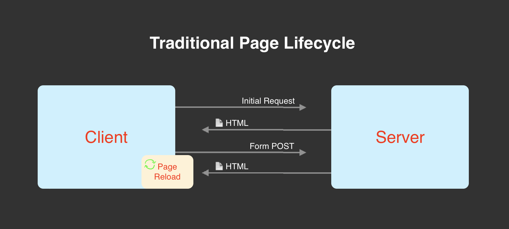

# SPA란?
> 싱글 페이지 애플리케이션(SPA)은 서버로부터 완전한 새로운 페이지를 불러오지 않고 현재의 페이지를 동적으로 다시 작성함으로써 사용자와 소통하는 웹 애플리케이션이나 웹사이트를 말한다.

여기서 싱글 페이지 애플리케이션이란 말그대로 페이지가 단일 페이지인 앱이다. 물론 진짜 페이지가 하나인건 아니다.

SPA를 알기전에 먼저 우리는 오래전부터 사용한 기존의 웹 페이지의 생명주기를 알필요가 있다. 아래는 두 애플리케이션의 Lifecycle을 이미지화 한것이다.

## Multi Page Application(SSR)

MPA는 보통 서버사이트렌더링(SSR)방식이다. 이 경우 서버에 요총이 오면 서버에서 HTML을 보내 클라이언트 화면에 그려주도록했다. 하지만 매번 변경사항이 있을 때마다 서버에 렌더링을 요청하여 정적 리소스가 다시 로드되고 새로고침 되며 페이지가 다시 그려지게 된다. 즉 불필요한 부분까지도 리로드되어 사용성이 떨어지게되고 서버쪽 트래픽도 많이 사용하게 된다. 이렇듯 굉장히 많은 리소스가 필요했지만 오늘날에는 AJAX 덕분에 원하는 특정 부분만을 리프레쉬 할 수 있도록 하여 많은 데이터가 오갈때 발생되는 문제를 해소 할 수 있게 되었다. 하지만 그에 따른 복잡성이 가중되면서 SPA보다 개발 공수가 커지게 되었다.

## Single Page Application(CSR)

SPA는 클라이언트사이드 렌더링 이라고도 한다. 이 경우 페이지 렌더링을 클라이언트 쪽에서 하게된다. 초기 요청에의해 로드된 리소스로 페이지를 표시한다. 리소스는 한번만 받아오기 때문에 이후에 페이지 이동이 발생해도 리로드를 할 필요가 없어진다. 즉 특정 요소가 변경되면 서버는 그에 따른 데이터만 응답해주고 브라우저는 응답된 데이터로 해당 요소만 바꿔주게 된다. 그로인해 네이티브 앱과 유사한 UX를 제고 할 수 있게 됬다.

## 장점 및 단점
SPA
* 장점
    * 네이티브 앱과 같은 UX를 제공
    * 서버에 요청이 줄어드므로 트래픽이 적음
* 단점
    * 한번에 리소스를 로드하기때문에 초기 구동 속도가 느림
    * IE8 이하 미지원

MPA
* 장점
    * SEO관리에 적절
* 단점
    * 백/프론트 개발 영역의 결합

## 정리
SPA는 CSR 방식으로 화면이 바뀔때마다 서버에서 기존 리소스들을 받아오지 않아 트래픽이 적고 렌더링 속도가 빠르며 빈번한 리로드를 하지 않기 때문에 좋은 사용성을 제공 하는것 같다. 반면 MPA를 이용한 개발은 개발 공수가 사용성에 비례해 크고 복잡해지므로 이를 이용한 웹 사이트가 많지 않아진것 같다.

오늘날 웹은 정말 빠르게 변화하고 있다. 그 변화에 따라 어떤 기술을 사용해야 하는가도 그만큼 중요해졌다. 분명한건 SPA는 오늘날 우리에게 좋은 UX를 제공하는 기술이며 기술의 발전과 동시에 앞으로 꾸준히 공부해야할 영역인것 같다.