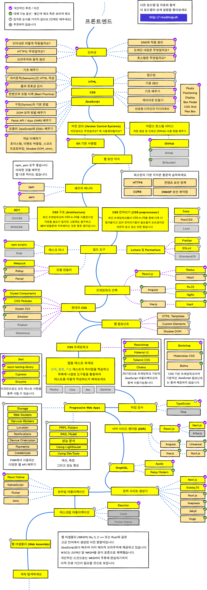

# Front-End
## 정의 
> 사용자(user)의 화면에 나타나는 웹 화면을 프론트엔드(Front-End) 영역이라 합니다.  
> 쉽게 말하면 웹페이지를 그리는 기술이라고 말씀 드릴 수 있습니다.  
> 이러한 영역을 설계하는 사람을 Front-End 개발자라고 합니다.

 

## 구성
>프론트엔드 파트는 UX designer, Web designer, Front-End developer로 구성됩니다.   
>>⊙UX 디자이너는 사용자에게 최상의 편리한 경험을 제공하기 위해 사이트의 구성/기능을 담당합니다.   
>>⊙Web 디자이너는 이를 디자인으로 멋지게 뽑아내는 당담입니다.  
>>⊙프론트엔드 개발자는 뽑아낸 디자인을 웹어플리케이션(Web application)으로 구현하는 것입니다.

 

## 사용 기술

### [HTML](html.md)

 

### [CSS](css.md)

 

### [JavaScript](https://github.com/KimGiHong/JS_StudyBook/blob/main/README.md)

 

## 프론트엔드 개발자 로드맵
### 꾸준히 공부합시다

